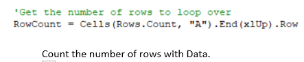

# Module 2 Challenge **VBA of Wall Street**

## Project Overview 

We have already created a macro that would calculate the annual volume and return for a list of stocks presorted by ticker and ascending by date.  The challenge presented is to refactor the code to improve its efficency and insert formatting.  The volume will be displayed with thousands separators, the cell color will represent positive or negative values and annual return  will display as a percentage with 1 decimal place.

## Results

### Setting up for success

Early in the code the creation of arrays, tickers, and writing of headers made for a foundation to proceed.  Four arrays are required all of them contain 12 pieces of information.
  
  1. ticker(12) - contains the ticker symbol of each stock, data type String.
  2. tickerVolumes(12) - used to sum the daily volume throughout the year, data type Long.
  3. tickerPrice_Start(12) - contains the stock price at the beginning of the year, data type Single.
  4. tickerPrice_End(12) - contains the stock price at the end of the year, data typer Single.

All of the tickerVolumes 0 to 11 must be set to 0 because we add the existing tickerVolume to each days individual ticker volume and any begining value would be inadvertantly added to the total for the year.  TickerPrice_Start and TickerPrice_End do not need to be initialized because they are only overwritten to be new values.

Another important line of code used in the opening portion of the Macro is one used to count the number rows in the source data.  This will be used to review each row of data for the information we are searching for.

### Combing through the data

Now we are ready to search each line for tickers, volumes, annual starting price and annual ending price.  We take advantage of the tickers being sorted by ticker and date to say that the price the 1st time a ticker appears is the tickerPrice_Start and when the ticker is going to change in the next row that is the ticketEnd_Price.  We also add each daily volume to the array for a given ticker. When the ticker changes the volume gets added to the new ticker volume.
  
Noticing that the ticker will change in the next row of data is the key to much of the refactoring.  Because when we know this is the last line, we can advance the tickerIndex to begin looking for the next stock ticker.  Because of this we only loop through the data once.  In the original algorithm we looped through all 3000+ rows once for each of the 12 ticker indices.
  

  
### Speed results
 
 ## Summary
  
 ### Refactoring Advantages and Disadvantages of Refactoring
  
Advantages of refactoring code include taking time to add functionality, remove code that may not be required for current functionality, increade efficency of the algorith (hindsight IS 20/20 after all) and it is a great time to improve the quantity and quality of comments along the way.
  
The disadvantages of refactoring lie in the amount of time required (its very hard to have a accurate estimate going in) and the chance that the code may become broken.  Broken code will take even more time just to get back to where the code started.
  
### Pros and Cons of Refactoring the Original "All Stocks Analysis" Macro
  
The most obvious advantage of the refactoring that occured in this code, in my opinion, was the formatting improvements.  It was easy to see the results and wasn't an excess amount of coding.  The fact that it ran faster is a nice feature but they both took less than a second.  Not significant enough to warrant an investment of time unless perhaps the intention is to use the algotithm to to analyze much larger data sets.  (The real advantage for us students was learning and practicing write VBA to accomplish a goal!)  
  
The downside is largely the investment of time.  Spending hours writing code to save less than a second of runtime is not a good investment.  There was also the possibilty of not being able to implement improvements. 
  

